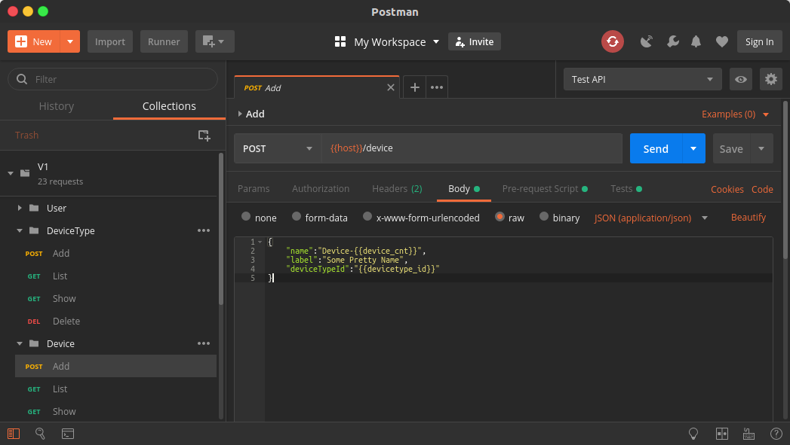

# Mock Rest Server

Mock server for FNP rest API based on `FNP.PLF.PUB.SystemSpecificationIoTAPI.00`


## Installation (with virtualenv)

In Linux terminal:
```
virtualenv test_mock
cd test_mock
source bin/activate

git clone http://172.16.110.15/fanthings/iot-mock-rest-server.git server
cd server
pip3 install -r requirements.txt 

python3 rest_server.py
```

In winows:
```
virtualenv test_mock
cd test_mock
Scripts\activate.bat 

git clone http://172.16.110.15/fanthings/iot-mock-rest-server.git server
cd server
pip install -r requirements.txt 

python rest_server.py
```

Check server logs in terminal

```console
> python3 rest_server.py
 * Running on http://0.0.0.0:5000/ (Press CTRL+C to quit)
 * Restarting with stat
 * Debugger is active!
 * Debugger PIN: 303-480-224
127.0.0.1 - - [15/Oct/2018 13:05:41] "POST /devicetype HTTP/1.1" 200 -
127.0.0.1 - - [15/Oct/2018 13:07:24] "GET /devicetype HTTP/1.1" 200 -
....

```

## Usage
Use [Postman](https://www.getpostman.com/) for testing the api!




## Run tests
Tests are placed in `/test` directory. Set `HOST` and `TOKEN` in `/test/test.py`
for running test. You can add a test-user using `add_testuser.py` script.

```console
> python add_testuser.py

User TESTUSER added!. Token="token-TESTUSER"

```